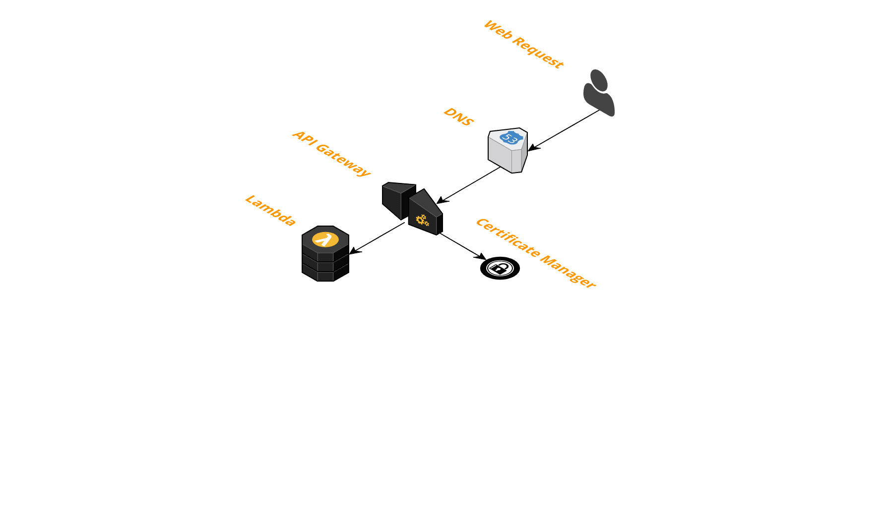

# API Gateway proxying calls to a Lambda backend.  Optional custom domain.
This template will create the following AWS resources:
- Lambda to handle api calls
- API Gateway to proxy HTTP requests to the Lambda backend
- Certificate Manager to provide the SSL cert
- Route53 to perform the DNS routing

# Setup
## Prerequisites
- Register your domain with Route53
- Or point your existing domain to Route53
- Configure 'admin@yourdomain.com' to receive the SSL verification email
  - You will have to confirm this email address.  This is annoying and I've asked AWS to remove this step if the domain is used with Route53.

## Stack Up
- Replace 'example.com' in _cim.yml with your domain name.
- Run `cim stack-up`

## Deploy Lambda
`cim lambda-deploy`

## dev stage
You can also deploy a dev environment for testing.

`cim stack-up --stage=dev`
`cim deploy-lambda --stage=dev`
